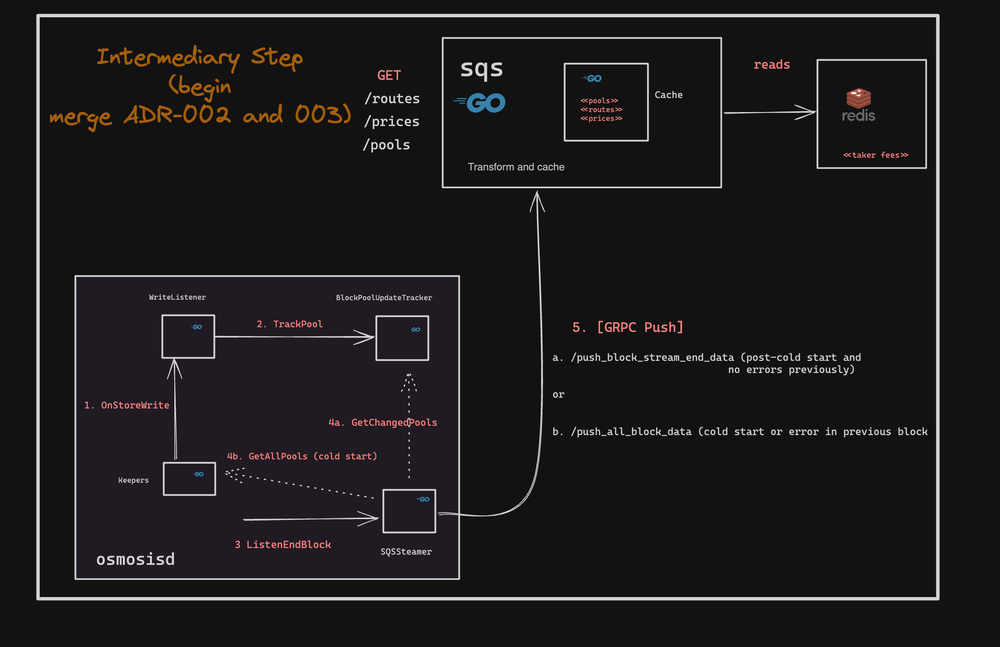

# Sidecar Query Server

This is a sidecar query server that is used for performing query tasks outside of the main chain.
The high-level architecture is that the chain reads data at the end of the block, parses it
and then writes into a Redis instance.

The sidecar query server then reads the parsed data from Redis and serves it to the client
via HTTP endpoints.

The use case for this is performing certain data and computationally intensive tasks outside of
the chain node or the clients. For example, routing falls under this category because it requires
all pool data for performing the complex routing algorithm.



## Integrator Guide

Follow [this link](https://hackmd.io/@osmosis/HkyIHvCH6) to find a guide on how to 
integrate with the sidecar query server.

## Custom CosmWasm Pools

The sidecar query server supports custom CosmWasm pools.
There are two options of integrating them into the Osmosis router:
1. Implement a pool type similar to [transmuter](https://github.com/osmosis-labs/sqs/blob/e95c66e3ee6a22d57118c74a384253f016a9bb85/router/usecase/pools/routable_transmuter_pool.go#L19)
   * This assumes that the pool quote and spot price logic is trivial enough for implementing
   it directly in SQS without having to interact with the chain.
2. Utilize a [generalized CosmWasm pool type](https://github.com/osmosis-labs/sqs/blob/437086c683f4f90d915f7e042617552c68410796/router/usecase/pools/routable_cw_pool.go#L24)
   * This assumes that the pool quote and spot price logic is complex enough for requiring
   interaction with the chain.
   * For quotes and spot prices, SQS service would make network API queries to the chain.
   * This is the simplest approach but it is less performant than the first option.
   * Due to performance reasons, the routes containing these pools are not utilized in
   more performant split quotes. Only direct quotes are supported.

To enable support for either option, a [config.json](https://github.com/osmosis-labs/sqs/blob/437086c683f4f90d915f7e042617552c68410796/config.json#L22-L25)
must be updated accordingly. For option 1, add a new field under `pools` and make a PR propagating
this config to be able to create a new custom pool type similar to transmuter. For option 2, simply
add your code id to `general-cosmwasm-code-ids` in this repository. Tag `@p0mvn` in the PR and
follow up that the config is deployed to the sidecar query server service in production.

## Osmosis Deployments

Our team maintains 3 SQS deployment environments.

### Production

`https://sqs.osmosis.zone`

This is a geo-distributed deployment across 3 regions that is used by the
production application `https://app.osmosis.zone`.

It operates on data from `osmosis-1` mainnet.

Note that in this environment we block all endpoints at nginx level except for:
- `/router/quote`
- `/router/custom-direct-quote`
- `/tokens/prices`
- `/pools`
- all debug and infra endpoints

There is swagger available [here](https://sqs.osmosis.zone/swagger/index.html#/default/get-token-metadata)

### Staging

`https://sqs.stage.osmosis.zone`

This is a deployment with 2 nodes that is used by our stage app
`https://stage.osmosis.zone/`. It is less stable and may experience downtime
due to experimental features.

It operates on data from `osmosis-1` mainnet.

Note that in this environment we block all endpoints at nginx level except for:
- `/router/quote`
- `/router/custom-direct-quote`
- `/tokens/prices`
- `/pools`
- all debug and infra endpoints

### Testnet

`https://sqs.testnet.osmosis.zone`

This is a testnet deployment made against `osmo-test-5` testnet state.

This environment exposes all endpoints listed below.

## Supported Endpoints

Note that there are more endpoints that can be found in the codebase but we
do not expose them publicly in out production environment.

### Pools Resource

1. GET `/pools?IDs=<IDs>`

Description: Returns of pools if IDs parameter is not given. Otherwise, 
batch fetches specific pools by the given parameter pool IDs.

Parameter: `IDs` - the list of pool IDs to batch fetch.

```
curl "http://localhost:9092/pools?IDs=1,2" | jq .
[
  {
    "chain_model": {
      "address": "osmo1mw0ac6rwlp5r8wapwk3zs6g29h8fcscxqakdzw9emkne6c8wjp9q0t3v8t",
      "id": 1,
      "pool_params": {
        "swap_fee": "0.002000000000000000",
        "exit_fee": "0.000000000000000000"
      },
      "future_pool_governor": "24h",
      "total_weight": "1073741824000000.000000000000000000",
      "total_shares": {
        "denom": "gamm/pool/1",
        "amount": "68705408290810473783205087"
      },
      "pool_assets": [
        {
          "token": {
            "denom": "ibc/27394FB092D2ECCD56123C74F36E4C1F926001CEADA9CA97EA622B25F41E5EB2",
            "amount": "1099147835604"
          },
          "weight": "536870912000000"
        },
        {
          "token": {
            "denom": "uosmo",
            "amount": "6560821009725"
          },
          "weight": "536870912000000"
        }
      ]
    },
    "balances": [
      {
        "denom": "ibc/27394FB092D2ECCD56123C74F36E4C1F926001CEADA9CA97EA622B25F41E5EB2",
        "amount": "1099147835604"
      },
      {
        "denom": "ibc/9989AD6CCA39D1131523DB0617B50F6442081162294B4795E26746292467B525",
        "amount": "1000000000"
      },
      {
        "denom": "ibc/B9E0A1A524E98BB407D3CED8720EFEFD186002F90C1B1B7964811DD0CCC12228",
        "amount": "999800"
      },
      {
        "denom": "uosmo",
        "amount": "6560821009725"
      }
    ],
    "type": 0,
    "spread_factor": "0.002000000000000000"
  },
  ...
]
```

### Router Resource


1. GET `/router/quote?tokenIn=<tokenIn>&tokenOutDenom=<tokenOutDenom>?singleRoute=<singleRoute>`

Description: returns the best quote it can compute for the given tokenIn and tokenOutDenom. If `singRoute` parameter is set to true, it gives the best single
quote while excluding splits

Parameters:
- `tokenIn` the string representation of the sdk.Coin for the token in
- `tokenOutDenom` the string representing the denom of the token out
- `singleRoute` (optional) boolean flag indicating whether to return single routes (no splits).
False (splits enabled) by default.
- `humanReadable` (optional) boolean flag indicating whether a human readable denom is given as opposed to chain.

Response example:

```bash
curl "https://sqs.osmosis.zone/router/quote?tokenIn=1000000uosmo&tokenOutDenom=uion?singleRoute=false" | jq .
{
  "amount_in": {
    "denom": "uosmo",
    "amount": "1000000"
  },
  "amount_out": "1803",
  "route": [
    {
      "pools": [
        {
          "id": 2,
          "type": 0,
          "balances": [],
          "spread_factor": "0.005000000000000000",
          "token_out_denom": "uion",
          "taker_fee": "0.001000000000000000"
        }
      ],
      "out_amount": "1803",
      "in_amount": "1000000"
    }
  ],
  "effective_fee": "0.006000000000000000"
}
```

2. GET `/router/routes?tokenIn=<tokenIn>&tokenOutDenom=<tokenOutDenom>`

Description: returns all routes that can be used for routing from tokenIn to tokenOutDenom

Parameters:
- `tokenIn` the string representation of the denom of the token in
- `tokenOutDenom` the string representing the denom of the token out
- `humanReadable` (optional) boolean flag indicating whether a human readable denom is given as opposed to chain.


Response example:

```bash
curl "https://sqs.osmosis.zone/router/routes?tokenIn=uosmo&tokenOutDenom=uion" | jq .
{
  "Routes": [
    {
      "Pools": [
        {
          "ID": 1100,
          "TokenOutDenom": "uion"
        }
      ]
    },
    {
      "Pools": [
        {
          "ID": 2,
          "TokenOutDenom": "uion"
        }
      ]
    },
    {
      "Pools": [
        {
          "ID": 1013,
          "TokenOutDenom": "uion"
        }
      ]
    },
    {
      "Pools": [
        {
          "ID": 1092,
          "TokenOutDenom": "ibc/E6931F78057F7CC5DA0FD6CEF82FF39373A6E0452BF1FD76910B93292CF356C1"
        },
        {
          "ID": 476,
          "TokenOutDenom": "uion"
        }
      ]
    },
    {
      "Pools": [
        {
          "ID": 1108,
          "TokenOutDenom": "ibc/9712DBB13B9631EDFA9BF61B55F1B2D290B2ADB67E3A4EB3A875F3B6081B3B84"
        },
        {
          "ID": 26,
          "TokenOutDenom": "uion"
        }
      ]
    }
  ],
  "UniquePoolIDs": {
    "1013": {},
    "1092": {},
    "1100": {},
    "1108": {},
    "2": {},
    "26": {},
    "476": {}
  }
}
```
3. GET `/router/custom-direct-quote?tokenIn=<tokenIn>&tokenOutDenom=<tokenOutDenom>&poolIDs=<poolIDs>`

Description: returns the quote over route with the given poolIDs. If such route does not exist, returns error.
This endpoint does not use the router route search. As a result, it is not affected by the minimum liquidity parameter. As long as the pool exists on-chain, it will return a quote.

Parameters:
- `tokenIn` the string representation of the sdk.Coin for the token in
- `tokenOutDenom` the string representing the denom of the token out
- `poolID` comma-separated list of pool IDs

Response example:

```bash
curl "https://sqs.osmosis.zone/router/custom-direct-quote?tokenIn=1000000uosmo&tokenOutDenom=uion&poolID=2" | jq .
{
  "amount_in": {
    "denom": "uosmo",
    "amount": "1000000"
  },
  "amount_out": "1803",
  "route": [
    {
      "pools": [
        {
          "id": 2,
          "type": 0,
          "balances": [],
          "spread_factor": "0.005000000000000000",
          "token_out_denom": "uion",
          "taker_fee": "0.001000000000000000"
        }
      ],
      "out_amount": "1803",
      "in_amount": "1000000"
    }
  ],
  "effective_fee": "0.006000000000000000"
}
```

### Tokens Resource

1. GET `/tokens/metadata`

Description: returns oken metadata with chain denom, human denom and precision.
For testnet, uses osmo-test-5 asset list. For mainnet, uses osmosis-1 asset list.
See `config.json` and `config-testnet.json` in root for details.

Parameter: denoms (optional). A list of denoms. Can either be human or chain denoms. If none given,
returns metadata for all denoms.

Response example:

```bash
curl "https://sqs.osmosis.zone/tokens/metadata/statom" | jq .
{
    "chain_denom": "ibc/C140AFD542AE77BD7DCC83F13FDD8C5E5BB8C4929785E6EC2F4C636F98F17901",
    "human_denom": "statom",
    "precision": 6
}
```

2. GET `/tokens/prices`

Parameters:
- `base` Comma-separated list of base denominations (human-readable or chain format based on humanDenoms parameter)
- `humanDenoms` Specify true if input denominations are in human-readable format; defaults to false.

Response:

A map where each key is a base denomination (on-chain format), containing another map with a key as the quote denomination (on-chain format) and the value as the spot price.

```bash
curl https://sqs.osmosis.zone//tokens/prices?base=wbtc,dydx&humanDenoms=true
{
    "ibc/831F0B1BBB1D08A2B75311892876D71565478C532967545476DF4C2D7492E48C": {
        "ibc/D189335C6E4A68B513C10AB227BF1C1D38C746766278BA3EEB4FB14124F1D858": "3.104120355715761583051226000000000000"
    },
    "ibc/D1542AA8762DB13087D8364F3EA6509FD6F009A34F00426AF9E4F9FA85CBBF1F": {
        "ibc/D189335C6E4A68B513C10AB227BF1C1D38C746766278BA3EEB4FB14124F1D858": "51334.702258726899383983572895277207392200"
    }
}
```

### System Resource

1. GET `/healthcheck`

Description: returns 200 if the server is healthy.
Validates the following conditions:
- Redis is reachable
- Node is reachable
- Node is not syncing
- The latest height in Redis is within threshold of the latest height in the node
- The latest height in Redis was updated within a configurable number of seconds

2. GET `/metrics`

Description: returns the prometheus metrics for the server

3. GET `/version`

Description: returns the version of the server

4. GET `/config`

Description: returns the configuration of the server, including the router.

## Development Setup

### Mainnet

#### Node Configuration

Ensure the following in `app.toml`

```toml
[osmosis-sqs]

# SQS service is disabled by default.
is-enabled = "true"

# The hostname and address of the sidecar query server storage.
grpc-ingest-address = "localhost:50051"
grpc-ingest-max-call-size-bytes = "50000000"
```

To setup a development environment against mainnet, sync the node in the default
home directory and then run the following commands:

```bash
# Starts the Osmosis node from the default $HOME directory
# Starts sqs from the config.json in the root of this repository
make all-start
```

## Data

### Pools

For every chain pool, its pool model is written to Redis.

Additionally, we instrument each pool model with bank balances and OSMO-denominated TVL.

Some pool models do not contain balances by default. As a result, clients have to requery balance
for each pool model directly from chain. Having the balances in Redis allows us to avoid this and serve
pools with balances directly.

The routing algorithm requires the knowledge of TVL for prioritizing pools. As a result, each pool model
is instrumented with OSMO-denominated TVL.

### Router

For routing, we must know about the taker fee for every denom pair. As a result, in the router
repository, we stote the taker fee keyed by the denom pair.

These taker fees are then read from Redis to initialize the router.

### Token Precision

The chain is agnostic to token precision. As a result, to compute OSMO-denominated TVL,
we query [chain registry file](https://github.com/osmosis-labs/assetlists/blob/main/osmosis-1/osmosis-1.assetlist.json)
parse the precision exponent and use it scaling the spot price to the right value.

The following are the tokens that are either malformed or are missing from the chain registry file:
```md
ibc/CD942F878C80FBE9DEAB8F8E57F592C7252D06335F193635AF002ACBD69139CC
ibc/FE2CD1E6828EC0FAB8AF39BAC45BC25B965BA67CCBC50C13A14BD610B0D1E2C4
ibc/4F3B0EC2FE2D370D10C3671A1B7B06D2A964C721470C305CBB846ED60E6CAA20
ibc/CD20AC50CE57F1CF2EA680D7D47733DA9213641D2D116C5806A880F508609A7A
ibc/52E12CF5CA2BB903D84F5298B4BFD725D66CAB95E09AA4FC75B2904CA5485FEB
ibc/49C2B2C444B7C5F0066657A4DBF19D676E0D185FF721CFD3E14FA253BCB9BC04
ibc/7ABF696369EFB3387DF22B6A24204459FE5EFD010220E8E5618DC49DB877047B
ibc/E27CD305D33F150369AB526AEB6646A76EC3FFB1A6CA58A663B5DE657A89D55D
factory/osmo130w50f7ta00dxkzpxemuxw7vnj6ks5mhe0fr8v/oDOGE
ibc/5BBB6F9C8ECA31508EE5B68F2E27B57532E1595C57D0AE5C8D64E1FBCB756247
ibc/00BC6883C29D45EAA021A55CFDD5884CA8EFF9D39F698A9FEF79E13819FF94F8
ibc/BCDB35B7390806F35E716D275E1E017999F8281A81B6F128F087EF34D1DFA761
ibc/020F5162B7BC40656FC5432622647091F00D53E82EE8D21757B43D3282F25424
ibc/D3A1900B2B520E45608B5671ADA461E1109628E89B4289099557C6D3996F7DAA
ibc/1271ACDB6421652A2230DECCAA365312A32770579C2B22D2B60A89FE39106611
ibc/DEA3B0BB0006C69E75D2247E8DC57878758790556487067F67748FDC237CE2AE
ibc/72D0C53912C461FC9251E3135459746380E9030C0BFDA13D45D3BAC47AE2910E
ibc/0E30775281643124D79B8670ACD3F478AC5FAB2B1CA1E32903D0775D8A8BB064
ibc/4E2A6E691D0EB60A25AE582F29D19B20671F723DF6978258F4043DA5692120AE
ibc/F2F19568D75125D7B88303ADC021653267443679780D6A0FD3E1EC318E0C51FD
factory/osmo19pw5d0jset8jlhawvkscj2gsfuyd5v524tfgek/TURKEY
```

Any pool containing these tokens would have the TVL error error set to
non-empty string, leading to the pool being deprioritized from the router.

### Pricing

There are two sources of pricing data:
1. On-chain
2. CoinGecko

#### Chain

On-chain pricing has the following two-cases:

**1. USDC Quote**

At the start of SQS, we pre-compute prices for all listed tokens as defined by the asset list
with USDC as the quote and store them in-memory (no expiration).

In subsequent blocks, whenever a pool is updated (swapped, LPed etc), we detect that and recompute the price during ingest time via background worker and update internal memory.

**2. Non-USDC Quote**
Computed on-demand and result is stored in cache with TTL.

General computation logic:
1. Compute routes between 2 tokens
2. Compute spot price over pools in that route
3. If there occurs an error in computing spot price, we fallback to computing a price
by swapping 10 units of the quote token (which in most cases today should be USDC).
The choise of 10 is such that we do not consider extremely low-liquidity routes that
may change frequently while also derisk the price impact with high-value non-USDC quotes.

#### CoinGecko

TBD

### Algorithm

In this section, we describe the general router algorithm.

1. Retrieve pools from storage.
2. Filter out low liquidity pools.
3. Rank pools by several heuristics such as:
 - liquidity
 - pool type (priority: transmuter, concentrated, stableswap, balancer)
 - presence of error in TVL computation.
4. Compute candidate routes
   * For the given token in and token out denom, find all possible routes
   between them using the pool ranking discussed above as well as by limiting
   the algorithm per configuration.
   * The configurations are:
      * Max Hops: The maximum number of hops allowed in a route.
      * Max Routes: The maximum number of routes to consider.
   * The algorithm that is currently used is breadth first search.
5. Compute the best quote when swapping amount in in-full directly over each route.
6. Sort routes by best quote.
7. Keep "Max Splittable Routes" and attempt to determine an optimal quote split across them
   * If the split quote is more optimal, return that. Otherwise, return the best single direct quote.

### Caching

We perform caching of routes to avoid having to recompute them on every request.
The routes are cached in a Redis instance.

There is a configuration parameter that enables the route cache to be updated every X blocks.
However, that is an experimental feature. See the configuration section for details.

The router also caches the routes when it computes it for the first time for a given token in and token out denom.
As of now, the cache is cleared at the end of very block. We should investigate only clearing pool data but persisting
the routes for longer while allowing for manual updates and invalidation.

### Configuration

The router has several configuration parameters that are set via `app.toml`.

See the recommended enabled configuration below:

```js
{
    "debug": false,
    // Web server port.
    "server-address": ":9092",
    // Endpoint timeout duration.
    "timeout-duration-secs": 2,
    // Log file to write to.
    "logger-filename": "sqs.log",
    // Flag indicating whether this is a production logger.
    "logger-is-production": true,
    // Log level
    "logger-level": "info",
    // RPC endpoint
    "grpc-gateway-endpoint": "http://localhost:26657",
    // Chain ID
    "chain-id": "osmosis-1",
    // Router-specific configuration
    "router": {
      // Pool IDs that are prioritized in the router.
      "preferred-pool-ids": [],
      // Maximum number of pools in one route.
      "max-pools-per-route": 4,
      // Maximum number of routes to search for.
      "max-routes": 20,
      // Maximum number of routes to split across.
      "max-split-routes": 3,
      // Maximum number of iterations to split a route across.
      "max-split-iterations": 10,
      // Minimum liquidity capitalization for a pool to be considered in the router.
      // The denomination assumed is pricnig.default-quote-human-denom.
      "min-liquidity-cap": 100,
      // Whether to enable route caching
      "route-cache-enabled": true,
      // How long the route is cached for before expiry in seconds.
      "route-cache-expiry-seconds": 600
    },
    "pools": {
        // Code IDs of Transmuter CosmWasm pools that
        // are supported
        "transmuter-code-ids": [148, 254],
        // Code IDs of generalized CosmWasm pools that
        // are suported. Note that these pools make network
        // requests to chain for quote estimation. As a result,
        // they are excluded from split routes.
        "general-cosmwasm-code-ids": []
    },
    "pricing": {
        // The number of milliseconds to cache the
        // pricing data for.
        "cache-expiry-ms": 2000,
        // The default quote chain denom.
        // 0 stands for chain. 1 for Coingecko.
        // Currently, only on-chain is supported.
        "default-source": "0",
        // The default quote chain denom.
        "default-quote-human-denom": "usdc"
    },
    // Whether to enable routes cache overwrite. An overwrite can be set via
    // the following endpoint: POST `/router/overwrite-route`
    "enable-overwrite-routes-cache": false
}
```

## Useful Osmosis Resources

- [ADR-002 SQS GRPC Refactor](https://www.notion.so/osmosiszone/ADR-002-SQS-GRPC-Ingest-Refactor-19fa05956d0344f58d40fbab57c08af7)
- [ADR-004 Cosmos SDK Streaming For SQS](https://www.notion.so/osmosiszone/ADR-003-Cosmos-SDK-Streaming-for-SQS-64dbc8b9ba6149259bf9870a43b7a4fc)
- [ADR-006 Streaming & GRPC Ingest](https://www.notion.so/osmosiszone/ADR-006-Streaming-GRPC-SQS-Ingest-4e3b2ff7d23e43e2a1f3c43adc3c26bc?pvs=13)
- [C4 L3 SQS Deployments](https://app.excalidraw.com/s/72t6r0pKvg5/4xLEjXi3KiU)
