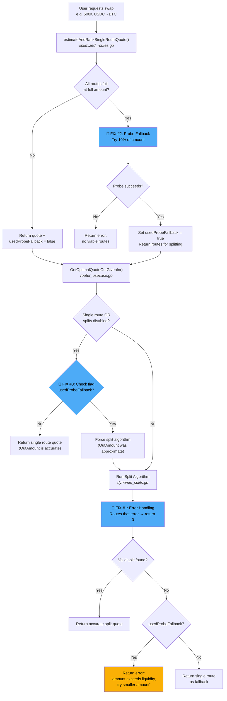

# PR Title

fix(router): handle large swaps exceeding route capacity (OSMO-53)

---

# PR Body

## Summary

Fixes critical bug where large USDC→BTC swaps (500K+) resulted in 94% slippage due to router selecting low-liquidity orderbook pool.

## Linear Issue

[OSMO-53: SQS router causes 94% slippage for large USDC to BTC swaps](https://linear.app/osmosis/issue/OSMO-53/sqs-router-causes-94percent-slippage-for-large-usdc-to-btc-swaps)

## Problem

1. Orderbook Pool 1930 has ~$42K liquidity but 0% spread factor
2. Router selected it for large swaps because it appeared "cheapest"
3. Error from insufficient liquidity was **silently ignored** in `dynamic_splits.go`
4. Result: Bad route passed to frontend → 94% slippage

## Solution (Three-Part Fix)

### Part 1: Error Handling in Split Algorithm
`dynamic_splits.go` - Routes that error now return 0 output instead of being silently ignored.

### Part 2: Probe Fallback for Route Ranking  
`optimized_routes.go` - When all routes fail at full amount:
- Retry with 10% probe amount to identify viable routes
- Pass working routes to split algorithm
- Split algorithm handles actual capacity allocation

### Part 3: Prevent Inaccurate Quote Returns (CodeRabbit feedback)
`router_usecase.go` - When probe fallback is used:
- Track `usedProbeFallback` flag through the call chain
- Skip early single-route returns (quote OutAmount would be inaccurate)
- Force split algorithm to run for accurate calculations
- Return clear error: `"requested amount exceeds available liquidity, try a smaller amount"`

## Solution Flow

## Flow Comparison

| Amount | Before | After |
|--------|--------|-------|
| 400K USDC | ✅ Works | ✅ Works |
| 500K USDC | ❌ 94% slippage (wrong quote shown) | ✅ Splits across CL pools or returns clear error |

## Files Changed

- `router/usecase/dynamic_splits.go` - Handle route errors in DP algorithm
- `router/usecase/optimized_routes.go` - Add probe fallback + `usedProbeFallback` return
- `router/usecase/router_usecase.go` - Propagate flag, skip early returns when probe used
- `router/usecase/export_test.go` - Update test exports for new signatures
- `router/usecase/optimized_routes_test.go` - Handle new return value
- `router/usecase/dynamic_splits_test.go` - Handle new return value

## Testing

- [ ] 400K USDC→BTC returns ~4.4 BTC (baseline)
- [ ] 500K USDC→BTC returns reasonable output OR clear error message
- [ ] Small swaps (<$10K) remain fast (no probe triggered)
- [ ] Direct pool quotes return error when amount exceeds pool capacity

## Related

Fixes OSMO-53

