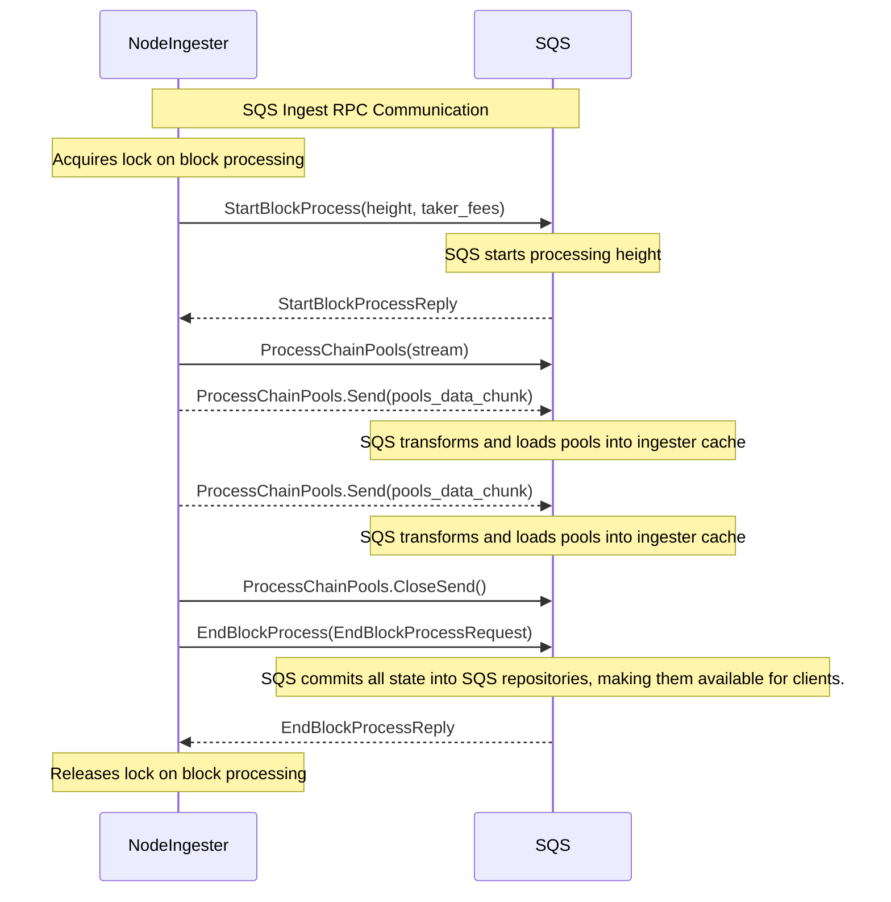

# Ingest

This is a component that is responsible for ingesting and processing data.

It exposes a GRPC API for Osmosis node clients to send data to be ingested.

Note that, as of right now the protocol is syncronous where each GRPC call happens in sequence. However, from the
node perspective it is processed in a separate goroutine, letting the node continue producing blocks. The node
acquires a lock on the block processing so that the interaction is not affected by synching.

This is not a concern since, when the node is caught up, the block time is approximately 4.5 seconds while entire
protocol is capped at 1.5 seconds.

Currently, we push all pool data into SQS every processed block. As we lower block time, we will introduce a mechanism for 
pushing the pool data only for the modified pools. This will allow us to drastically lower the protocol interaction from 1.5 seconds.

Alternative methods will include making the protocol more asyncronous but this will require introducing more complex
locking mechanisms which are overkill today.
